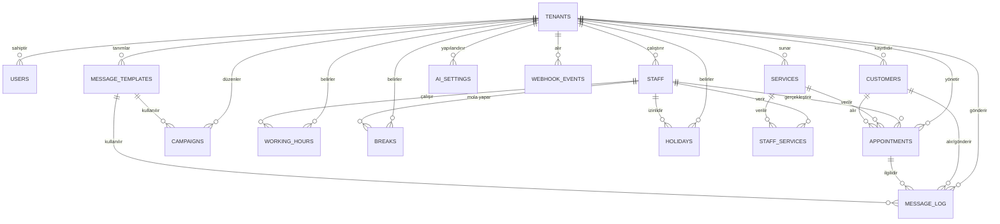

# 02 — Database Design

## 1. ER Diyagramı (mermaid)



## 2. Ortak Kurallar

- Tüm birincil anahtarlar `uuid` (`gen_random_uuid()`), tahmin edilebilir sıralı ID sızıntısını önler.
- **Tenant'a bağlı her tabloda `tenant_id uuid not null references tenants(id)` zorunludur** — istisnasız.
- Her tenant tablosunda RLS açık ve aynı politika deseni uygulanır (bkz. §5). Tekrar önlemek için burada tek örnek verilip diğer tablolarda "RLS: standart" notuyla geçilecek.
- Zaman alanları `timestamptz`; işletme saat dilimi `tenants.timezone` alanında tutulur, uygulama katmanı dönüşümü yapar.
- Soft-delete yerine `active boolean default true` (hizmet/personel) veya `status` enum (randevu) kullanılır; geçmiş kayıtlar silinmez.

```sql
CREATE EXTENSION IF NOT EXISTS pgcrypto;   -- gen_random_uuid()
CREATE EXTENSION IF NOT EXISTS btree_gist; -- exclusion constraint için
```

## 3. Tablolar

### 3.1 tenants (izolasyonun kök tablosu)

```sql
CREATE TABLE tenants (
    id                      uuid PRIMARY KEY DEFAULT gen_random_uuid(),
    business_name           text NOT NULL,
    phone_number_id         text NOT NULL UNIQUE,   -- Meta webhook eşleştirme anahtarı
    waba_id                 text NOT NULL,
    access_token_encrypted  bytea NOT NULL,          -- pgcrypto/uygulama katmanında şifreli
    webhook_verify_token    text NOT NULL,
    timezone                text NOT NULL DEFAULT 'Europe/Istanbul',
    subscription_plan       text NOT NULL DEFAULT 'trial'
                             CHECK (subscription_plan IN ('trial','basic','pro','enterprise')),
    status                  text NOT NULL DEFAULT 'active'
                             CHECK (status IN ('active','suspended','cancelled')),
    logo_url                text,
    address                 text,
    location_lat            double precision,
    location_lng            double precision,
    created_at              timestamptz NOT NULL DEFAULT now(),
    updated_at              timestamptz NOT NULL DEFAULT now()
);
```

`tenants` kendisi tenant-scoped değildir (kök); RLS burada uygulanmaz, erişim yalnızca süper-admin/backend servis rolüyle yapılır.

### 3.2 users (panel kullanıcıları — berber/admin/personel girişi)

```sql
CREATE TABLE users (
    id            uuid PRIMARY KEY DEFAULT gen_random_uuid(),
    tenant_id     uuid NOT NULL REFERENCES tenants(id) ON DELETE CASCADE,
    email         citext NOT NULL,
    password_hash text NOT NULL,
    role          text NOT NULL DEFAULT 'owner'
                  CHECK (role IN ('owner','manager','staff')),
    active        boolean NOT NULL DEFAULT true,
    created_at    timestamptz NOT NULL DEFAULT now(),
    UNIQUE (tenant_id, email)
);
-- RLS: standart
```

### 3.3 staff (personel)

```sql
CREATE TABLE staff (
    id         uuid PRIMARY KEY DEFAULT gen_random_uuid(),
    tenant_id  uuid NOT NULL REFERENCES tenants(id) ON DELETE CASCADE,
    name       text NOT NULL,
    phone      text,
    photo_url  text,
    active     boolean NOT NULL DEFAULT true,
    created_at timestamptz NOT NULL DEFAULT now()
);
-- RLS: standart
```

### 3.4 services (hizmetler)

```sql
CREATE TABLE services (
    id               uuid PRIMARY KEY DEFAULT gen_random_uuid(),
    tenant_id        uuid NOT NULL REFERENCES tenants(id) ON DELETE CASCADE,
    name             text NOT NULL,
    duration_minutes integer NOT NULL CHECK (duration_minutes > 0),
    price            numeric(10,2) NOT NULL CHECK (price >= 0),
    active           boolean NOT NULL DEFAULT true,
    created_at       timestamptz NOT NULL DEFAULT now()
);
-- RLS: standart
```

### 3.5 staff_services (personel ↔ hizmet, N:N)

```sql
CREATE TABLE staff_services (
    tenant_id  uuid NOT NULL REFERENCES tenants(id) ON DELETE CASCADE,
    staff_id   uuid NOT NULL REFERENCES staff(id) ON DELETE CASCADE,
    service_id uuid NOT NULL REFERENCES services(id) ON DELETE CASCADE,
    PRIMARY KEY (staff_id, service_id)
);
-- RLS: standart
```

### 3.6 working_hours (haftalık çalışma saatleri)

```sql
CREATE TABLE working_hours (
    id         uuid PRIMARY KEY DEFAULT gen_random_uuid(),
    tenant_id  uuid NOT NULL REFERENCES tenants(id) ON DELETE CASCADE,
    staff_id   uuid NOT NULL REFERENCES staff(id) ON DELETE CASCADE,
    day_of_week smallint NOT NULL CHECK (day_of_week BETWEEN 0 AND 6), -- 0=Pazar
    start_time  time NOT NULL,
    end_time    time NOT NULL CHECK (end_time > start_time),
    UNIQUE (staff_id, day_of_week, start_time)
);
-- RLS: standart
```

### 3.7 breaks (molalar — günlük tekrarlayan)

```sql
CREATE TABLE breaks (
    id          uuid PRIMARY KEY DEFAULT gen_random_uuid(),
    tenant_id   uuid NOT NULL REFERENCES tenants(id) ON DELETE CASCADE,
    staff_id    uuid NOT NULL REFERENCES staff(id) ON DELETE CASCADE,
    day_of_week smallint NOT NULL CHECK (day_of_week BETWEEN 0 AND 6),
    start_time  time NOT NULL,
    end_time    time NOT NULL CHECK (end_time > start_time)
);
-- RLS: standart
```

### 3.8 holidays (tatiller/izinler — tarih aralığı, personele özel veya işletme geneli)

```sql
CREATE TABLE holidays (
    id        uuid PRIMARY KEY DEFAULT gen_random_uuid(),
    tenant_id uuid NOT NULL REFERENCES tenants(id) ON DELETE CASCADE,
    staff_id  uuid REFERENCES staff(id) ON DELETE CASCADE, -- NULL = tüm işletme kapalı
    date_range daterange NOT NULL,
    reason    text,
    UNIQUE (tenant_id, staff_id, date_range)
);
-- RLS: standart
```

### 3.9 customers (müşteriler — WhatsApp numarasıyla tenant bazlı benzersiz)

```sql
CREATE TABLE customers (
    id           uuid PRIMARY KEY DEFAULT gen_random_uuid(),
    tenant_id    uuid NOT NULL REFERENCES tenants(id) ON DELETE CASCADE,
    whatsapp_number text NOT NULL,
    name         text,
    created_at   timestamptz NOT NULL DEFAULT now(),
    UNIQUE (tenant_id, whatsapp_number)
);
-- RLS: standart
```

### 3.10 appointments (randevular — çakışma DB seviyesinde engellenir)

```sql
CREATE TABLE appointments (
    id          uuid PRIMARY KEY DEFAULT gen_random_uuid(),
    tenant_id   uuid NOT NULL REFERENCES tenants(id) ON DELETE CASCADE,
    customer_id uuid NOT NULL REFERENCES customers(id) ON DELETE RESTRICT,
    staff_id    uuid NOT NULL REFERENCES staff(id) ON DELETE RESTRICT,
    service_id  uuid NOT NULL REFERENCES services(id) ON DELETE RESTRICT,
    time_range  tstzrange NOT NULL,
    status      text NOT NULL DEFAULT 'pending'
                CHECK (status IN ('pending','confirmed','cancelled','completed','no_show')),
    notes       text,
    created_at  timestamptz NOT NULL DEFAULT now(),
    updated_at  timestamptz NOT NULL DEFAULT now(),

    -- Aynı personelin aynı tenant içinde çakışan aktif randevusu olamaz.
    -- cancelled/no_show durumundaki randevular kısıtın dışında tutulur.
    EXCLUDE USING gist (
        tenant_id WITH =,
        staff_id  WITH =,
        time_range WITH &&
    ) WHERE (status IN ('pending','confirmed'))
);

CREATE INDEX idx_appointments_tenant_time ON appointments (tenant_id, time_range);
CREATE INDEX idx_appointments_customer ON appointments (customer_id);
-- RLS: standart
```

`time_range` uygulama katmanında `[randevu_başlangıcı, randevu_başlangıcı + service.duration_minutes)` olarak hesaplanır ve INSERT/UPDATE anında set edilir; bu sayede hizmet süresi değişse bile geçmiş randevu aralığı sabit kalır.

### 3.11 message_templates (Meta onaylı şablonların panel karşılığı)

```sql
CREATE TABLE message_templates (
    id                uuid PRIMARY KEY DEFAULT gen_random_uuid(),
    tenant_id         uuid NOT NULL REFERENCES tenants(id) ON DELETE CASCADE,
    internal_name     text NOT NULL,        -- panelde görünen ad
    meta_template_name text NOT NULL,       -- Meta'da onaylı şablon adı
    template_type     text NOT NULL
                      CHECK (template_type IN ('reminder','confirmation','cancellation','campaign','other')),
    variables         jsonb NOT NULL DEFAULT '[]',
    active            boolean NOT NULL DEFAULT true,
    UNIQUE (tenant_id, internal_name)
);
-- RLS: standart
```

### 3.12 message_log (gönderilen/alınan tüm mesajların denetim izi)

```sql
CREATE TABLE message_log (
    id             uuid PRIMARY KEY DEFAULT gen_random_uuid(),
    tenant_id      uuid NOT NULL REFERENCES tenants(id) ON DELETE CASCADE,
    customer_id    uuid REFERENCES customers(id) ON DELETE SET NULL,
    appointment_id uuid REFERENCES appointments(id) ON DELETE SET NULL,
    direction      text NOT NULL CHECK (direction IN ('inbound','outbound')),
    template_id    uuid REFERENCES message_templates(id),
    content        jsonb NOT NULL,   -- ham mesaj/şablon değişkenleri
    status         text NOT NULL DEFAULT 'sent'
                   CHECK (status IN ('sent','delivered','read','failed')),
    sent_at        timestamptz NOT NULL DEFAULT now()
);
CREATE INDEX idx_message_log_tenant_time ON message_log (tenant_id, sent_at DESC);
-- RLS: standart
```

### 3.13 campaigns (toplu kampanya mesajları)

```sql
CREATE TABLE campaigns (
    id            uuid PRIMARY KEY DEFAULT gen_random_uuid(),
    tenant_id     uuid NOT NULL REFERENCES tenants(id) ON DELETE CASCADE,
    name          text NOT NULL,
    template_id   uuid NOT NULL REFERENCES message_templates(id),
    target_filter jsonb NOT NULL DEFAULT '{}',  -- ör. {"last_visit_before":"..."}
    scheduled_at  timestamptz,
    status        text NOT NULL DEFAULT 'draft'
                  CHECK (status IN ('draft','scheduled','sent','cancelled')),
    created_at    timestamptz NOT NULL DEFAULT now()
);
-- RLS: standart
```

### 3.14 ai_settings (tenant başına AI asistan yapılandırması)

```sql
CREATE TABLE ai_settings (
    tenant_id     uuid PRIMARY KEY REFERENCES tenants(id) ON DELETE CASCADE,
    enabled       boolean NOT NULL DEFAULT false,
    tone          text NOT NULL DEFAULT 'friendly',
    knowledge_base jsonb NOT NULL DEFAULT '{}',  -- SSS, işletmeye özel bilgiler
    updated_at    timestamptz NOT NULL DEFAULT now()
);
-- RLS: standart
```

### 3.15 webhook_events (ham webhook denetim izi — tenant henüz çözülmemiş olabilir)

```sql
CREATE TABLE webhook_events (
    id               uuid PRIMARY KEY DEFAULT gen_random_uuid(),
    tenant_id        uuid REFERENCES tenants(id) ON DELETE SET NULL, -- eşleşmezse NULL
    phone_number_id  text NOT NULL,
    signature_valid  boolean NOT NULL,
    payload          jsonb NOT NULL,
    processed        boolean NOT NULL DEFAULT false,
    received_at      timestamptz NOT NULL DEFAULT now()
);
CREATE INDEX idx_webhook_events_phone ON webhook_events (phone_number_id, received_at DESC);
```

`tenant_id` NULL olabildiği için bu tabloda RLS **uygulanmaz**; erişim yalnızca backend servis rolüyle sınırlıdır (eşleşmeyen/şüpheli istekleri incelemek için).

## 4. İlişki Özeti

| İlişki | Tip | Not |
|--------|-----|-----|
| tenants → users/staff/services/customers/... | 1:N | Tüm tenant-scoped tablolar |
| staff ↔ services | N:N | `staff_services` ara tablosu |
| staff → working_hours/breaks/holidays | 1:N | Personel bazlı takvim kuralları |
| customers → appointments | 1:N | Bir müşterinin birden çok randevusu |
| staff, service → appointments | 1:N | Randevu her ikisine referans verir |
| appointments → message_log | 1:N | Randevuyla ilişkili hatırlatma/onay mesajları |
| message_templates → campaigns, message_log | 1:N | Şablon tekrar kullanılır |

## 5. Tenant İzolasyonu — RLS Standardı

Uygulama, bağlantı havuzundan bir bağlantı aldığında **her istek başında** o isteğin tenant'ını ayarlar:

```sql
SET app.current_tenant = '<tenant_uuid>';
```

Her tenant-scoped tabloda aynı desen uygulanır (örnek: `appointments`, diğerlerinde tablo adı değişir):

```sql
ALTER TABLE appointments ENABLE ROW LEVEL SECURITY;
ALTER TABLE appointments FORCE ROW LEVEL SECURITY;  -- tablo sahibi dahil herkese uygulanır

CREATE POLICY tenant_isolation ON appointments
    USING (tenant_id = current_setting('app.current_tenant', true)::uuid)
    WITH CHECK (tenant_id = current_setting('app.current_tenant', true)::uuid);
```

Bu politika `users, staff, services, staff_services, working_hours, breaks, holidays, customers, appointments, message_templates, message_log, campaigns, ai_settings` tablolarının tümüne birebir uygulanır (tablo adı ve `tenant_id` kolonu dışında hiçbir şey değişmez).

**Savunma katmanları (ikisi birden zorunlu):**
1. Repository katmanı her sorguya `WHERE tenant_id = :tenant_id` ekler (§ 01_System_Architecture.md).
2. RLS, uygulama kodunda unutulan/bug'lı bir sorguyu DB seviyesinde durdurur — `current_setting` boşsa politika hiçbir satır döndürmez (`true` parametresi eksik ayarda hata yerine NULL verir, NULL karşılaştırması false olur).

## 6. Randevu Çakışması — Neden Exclusion Constraint

- Uygulama katmanında "uygun mu?" kontrolü yarış durumuna (race condition) açıktır: iki müşteri aynı anda aynı slotu onaylayabilir.
- `EXCLUDE USING gist (tenant_id WITH =, staff_id WITH =, time_range WITH &&)` PostgreSQL'e INSERT/UPDATE anında **atomik** çakışma kontrolü yaptırır; ikinci çakışan INSERT veritabanı hatasıyla (`23P01`) reddedilir.
- Backend bu hatayı yakalayıp müşteriye "seçilen saat az önce doldu, lütfen başka slot seçin" mesajını döndürür — takvim algoritmasının önerdiği slotlar her zaman DB'nin son sözüyle doğrulanır (bkz. 03_Backend_API.md).
- `WHERE (status IN ('pending','confirmed'))` koşulu iptal edilmiş randevuların kısıtı bloklamasını engeller; geçmiş kayıt korunur ama slot yeniden açılır.

---
**STATUS: PHASE_2_COMPLETE**
